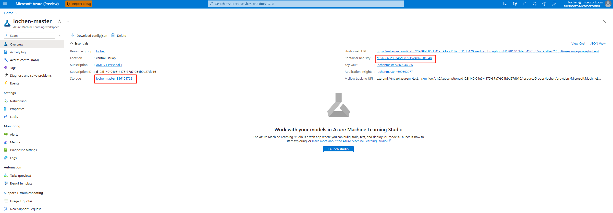

# Grant access to promptflow with custom role
If you follow [the template to create custom role for promptflow](../create-custom-role/), you can use this custom role to grant enough permission to use promptflow runtime.

## Assign role to user and identity
- Follow this doc to [Assign role in portal](https://learn.microsoft.com/en-us/azure/role-based-access-control/role-assignments-portal)
- Use [this template](../assign-custom-role/) to use this custom role to grant enough permission to use promptflow runtime.
    - You can use [](https://portal.azure.com/#create/Microsoft.Template/uri/https%3A%2F%2Fraw.githubusercontent.com%2Fcloga%2Fazure-quickstart-templates%2Flochen%2Fpromptflow%2Fquickstarts%2Fmicrosoft.machinelearningservices%2Fmachine-learning-prompt-flow%2Fassign-custom-role%2Fazuredeploy.json)
    - Use Azure CLI to deploy this template
        ```bash
        echo "Enter the template file path and file name:"
        read templateFile
        echo "Enter the parameters file path and file name:"
        read parameterFile      
        az deployment group  create \
          --name DeployLocalTemplate \
          --resource-group $resourceGroupName \
          --template-file $templateFile \
          --parameters @$parameterFile \
          --verbose
        ```
## Find workspace linked storage and container registry.
- Got to workspace detail page in Azure portal
Find the workspace in the Azure portal 

Or find it's Azure portal link in workspace page.


- Find linked storage and container registry


## Find Principle of user
Use `az ad user show --id jondoe@contoso.com --query id` to get principle of user

## Find Principle of identity of managed online endpoint
- Find related endpoint in runtime page

- Click metrics to jump to endpoint detail page in Azure portal

- Find identity id under identity page

## Learn more
- [Deploy resources with ARM templates and Azure CLI](https://learn.microsoft.com/en-us/azure/azure-resource-manager/templates/deploy-cli)
- [Tutorial - Create and deploy template - Azure Resource Manager](https://learn.microsoft.com/en-us/azure/azure-resource-manager/templates/template-tutorial-create-first-template)
- [Azure custom roles - Azure RBAC](https://learn.microsoft.com/en-us/azure/role-based-access-control/custom-roles)